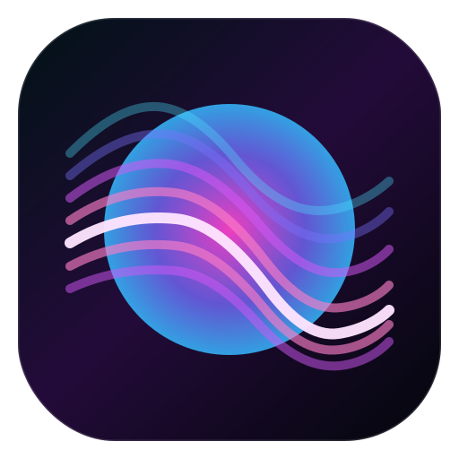

# LiveViz

LiveViz is a macOS system-audio visualizer with a transparent default presentation, neon line art, fullscreen desktop mode, and keyboard-only controls.



## Features

- Transparent by default, with only the neon visualizer lines visible
- `B` toggles the dark gradient background
- `F` toggles immersive desktop-style fullscreen
- Borderless fullscreen with hidden traffic lights
- `Up Arrow` and `Down Arrow` change visual intensity
- No overlay text inside the visualizer surface
- Controls exposed in the macOS `Help` menu
- Stable bundle ID and version fields for consistent app identity
- Packaging script emits both a `.app` bundle and a `.zip`

## Requirements

- macOS 14 or newer
- Swift 6 toolchain / recent Xcode command line tools
- Screen Recording permission, because system audio capture uses `ScreenCaptureKit`

## Controls

- `F`: Toggle desktop fullscreen
- `B`: Toggle background
- `Up Arrow`: Increase intensity
- `Down Arrow`: Decrease intensity
- `Esc`: Exit immersive fullscreen

## Build

```bash
swift build
```

## Package

```bash
./scripts/package.sh
```

Outputs:

- `dist/LiveViz.app`
- `dist/LiveViz-<version>.zip`

## Versioning

Bundle identity and version numbers are set in `Config/version.env`:

- `BUNDLE_ID`
- `MARKETING_VERSION`
- `CURRENT_PROJECT_VERSION`

If you want macOS to stop re-prompting across future installs as reliably as possible, keep the same bundle identifier and sign releases with the same real Developer ID certificate.

## Repository Layout

- `Sources/LiveViz`: app source
- `scripts/package.sh`: release packaging
- `scripts/generate_icon.swift`: reproducible app icon generation
- `Config/version.env`: bundle ID and version info

## Notes

The first launch will still require Screen Recording permission. That is expected for system-audio capture on macOS.
